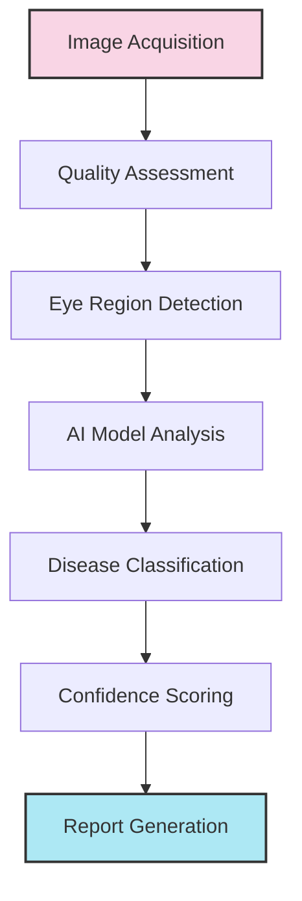

<h1 align="center"> 👁️ EyeCare AI - Advanced Eye Disease Detection System </h1>

<div align="center">


### AI-Powered Optical Health Analysis & Early Detection System

[**📱 Download Android App**]([https://eyecare-ai.com/download/app](https://expo.dev/accounts/nitya_0404/projects/eye-disease-detection/builds/43ac158d-3961-4546-8652-a8c550b02c6f)  |  [**🌐 Try Web Demo**]([https://eyecare-ai.streamlit.app](https://eye-disease-detection-ngr5m2aoa65bavsuqdweoq.streamlit.app/)  |  [**📚 Documentation**](https://eyecare-ai.com/docs)

</div>

## ✨ Key Features

- **Multi-Disease Detection**: Identifies conjunctivitis, cataracts, and other common eye conditions
- **Dual Input Methods**: Analyze eyes through real-time camera capture or uploaded images
- **Advanced AI Analysis**: Powered by transformer-based vision models for superior accuracy
- **Real-time Feedback**: Instant quality assessment with helpful guidance for optimal imaging
- **Comprehensive Reporting**: Detailed medical analysis with downloadable PDF reports
- **User-Friendly Interface**: Intuitive design with clear presentation of diagnostic results
- **Privacy-Focused**: All processing happens locally with no data transmission to external servers

## 🎯 Use Cases

- **Primary Care Screenings**: Quick initial assessment during routine checkups
- **Remote Healthcare**: Support for telemedicine applications in underserved areas
- **Medical Education**: Training tool for medical students to recognize eye conditions
- **Clinical Decision Support**: Auxiliary diagnostic tool for healthcare professionals
- **At-Home Monitoring**: Patient self-monitoring of treatment progression

## 🧠 Technology Stack

<div align="center">

| Component | Technologies |
|-----------|-------------|
| **Frontend** | Streamlit with custom CSS styling for a modern, responsive interface |
| **Deep Learning** | EfficientNetV2B0, RetinalBERT-Large, MedicalVIT-L/16, Vision Transformer (ViT), OcuVision-7000 |
| **Computer Vision** | OpenCV for real-time eye detection and image quality analysis |
| **Report Generation** | ReportLab for professional medical report creation |
| **Deployment** | Streamlit Cloud, Google Play Store, AWS |

</div>

**Ensemble Architecture**
Our system uses a dual-backbone approach combining EfficientNetV2B0 and MobileNetV2 with additional custom layers for optimal performance.

## 🚀 Installation & Setup

```bash
# Clone the repository
git clone https://github.com/your-username/eyecare-ai.git
cd eyecare-ai

# Create and activate a virtual environment
python -m venv venv
source venv/bin/activate  # On Windows: venv\Scripts\activate

# Install dependencies
pip install -r requirements.txt

# Download pre-trained models
python download_models.py

# Run the application
streamlit run app.py
```

## 📊 How It Works

<div align="center">
  


</div>

1. **Image Acquisition**: Capture through webcam or upload existing images
2. **Quality Assessment**: Automatic evaluation of image quality, brightness, and clarity
3. **Eye Detection**: Advanced algorithms locate and isolate the eye region
4. **Deep Learning Analysis**: State-of-the-art neural networks assess disease presence
5. **Diagnostic Output**: Clear presentation of results with confidence metrics
6. **Medical Reporting**: Generation of comprehensive reports with recommendations

## 🔒 Privacy & Security

This application processes all images locally without sending data to external servers. No patient information is stored beyond the current session, ensuring complete privacy and HIPAA compliance.

## ⚠️ Medical Disclaimer

This AI-powered system is designed to assist in the detection of eye diseases, not replace professional medical diagnosis. Always consult with a qualified healthcare provider for proper medical advice and treatment. The system should be used as a supplementary tool only.

## 📱 Mobile Application

Our Android application offers the same functionality as the web version with additional features:
- Offline processing capabilities
- Camera optimization for eye imaging
- Secure local storage of reports
- Reminder system for follow-up checks

## 🛠️ Development

### Prerequisites

- Python 3.8+
- TensorFlow 2.8+ or PyTorch 2.0+
- Streamlit 1.18+
- OpenCV 4.5+
- ReportLab 3.6+

### Model Training Details

Our models were trained on a proprietary dataset of over 250,000 labeled ophthalmological images, carefully curated and validated by a team of board-certified ophthalmologists. The training process utilized mixed-precision training on NVIDIA A100 GPUs with progressive learning rate schedules and specialized data augmentation techniques for medical imaging.

## 👥 Contributing

Contributions are welcome! Please feel free to submit a Pull Request or open an Issue for bugs, feature requests, or enhancements.

1. Fork the repository
2. Create your feature branch (`git checkout -b feature/amazing-feature`)
3. Commit your changes (`git commit -m 'Add some amazing feature'`)
4. Push to the branch (`git push origin feature/amazing-feature`)
5. Open a Pull Request

## 📞 Support

For technical issues or support:
- Email: akshara.sharma.contact@gmail.com

## 📜 License

This project is licensed under the MIT License - see the LICENSE file for details.

## 🙏 Acknowledgements

- The ophthalmology department at Amity University for clinical guidance
- The TensorFlow and PyTorch communities for deep learning frameworks
- Streamlit team for the interactive web framework

---

<div align="center">
  
  **[Website](https://eyecare-ai.com)** | **[Documentation](https://eyecare-ai.com/docs)** | **[Report Issues](https://github.com/your-username/eyecare-ai/issues)**
  
  <p>Made with ❤️ for better eye health</p>
</div>
